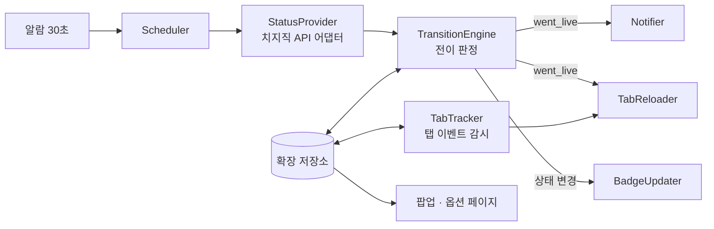
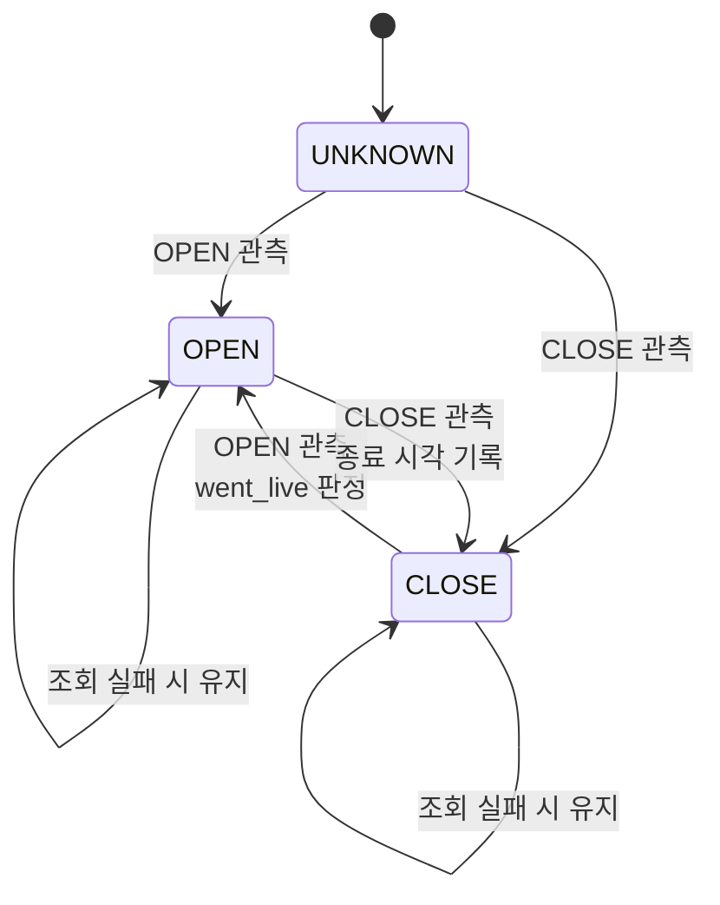
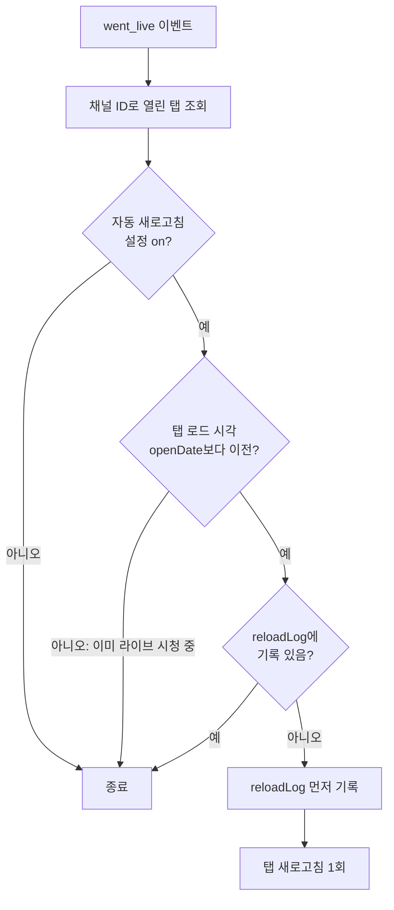

# 치지직 라이브 알림 크롬 확장 — 구현 계획

Sep 23, 2026 · @JH

## 개요

즐겨찾기한 치지직 채널의 방송 시작을 1분 이내에 감지해 Windows 알림으로 전달하고, 해당 채널의 오프라인 라이브 페이지를 열어 둔 경우 1회 자동 새로고침해 라이브 화면으로 전환하는 개인용 크롬 확장입니다.

- **목적**: 방송이 켜진 순간을 놓치지 않기.
- **사용 환경**: PC가 켜져 있는 동안 크롬이 상시 실행됨. 개발자 모드로 로드하며 스토어 배포는 하지 않음.
- **범위**: 방송 시작 감지, 알림, 툴바 배지와 팝업 목록, 오프라인 페이지 자동 새로고침, 채널 등록과 설정.
- **비목표**: 유튜브 연동, 채팅 기록·분석, 음량 정규화, 다른 사용자 대상 배포. 추후 별도 모듈로 확장 가능하도록 구조만 열어 둡니다.

## 요구사항

기능 요구사항 7개와 비기능 요구사항 5개로 구성합니다. FR-6이 이번에 추가된 신기능입니다.

| ID | 기능 요구사항 | 우선순위 |
| --- | --- | --- |
| FR-1 | 등록된 채널의 라이브 상태를 주기적으로 조회 | 필수 |
| FR-2 | CLOSE → OPEN 전이 시 Windows 알림 발생, 클릭 시 방송 탭 열기 | 필수 |
| FR-3 | 툴바 배지에 현재 라이브 중인 채널 수 표시 | 필수 |
| FR-4 | 팝업에 라이브 중인 채널 목록 표시(제목, 시청자 수, 경과 시간) | 필수 |
| FR-5 | 채널 등록·삭제(채널 URL 붙여 넣기로 ID 추출) | 필수 |
| FR-6 | 등록 채널의 오프라인 라이브 페이지가 열려 있을 때, 방송 시작 감지 시 해당 탭을 1회 자동 새로고침 | 필수 |
| FR-7 | 채널별 알림·자동 새로고침 on/off, 알림 금지 시간대, 제목·카테고리 키워드 필터 | 선택 |

| ID | 비기능 요구사항 | 기준 |
| --- | --- | --- |
| NFR-1 | 감지 지연 | 방송 시작 후 최대 약 60초 이내 알림 |
| NFR-2 | 알림 정확성 | 방송 1회당 알림 1회. 네트워크 오류·송출 재시작으로 인한 중복 알림 없음 |
| NFR-3 | 새로고침 안전성 | 방송 1회당 탭별 최대 1회. 이미 라이브를 보고 있는 탭은 새로고침하지 않음 |
| NFR-4 | 요청 부하 | 채널 수 N에 대해 30초당 요청 N회 이하, 요청 간 간격 분산 |
| NFR-5 | 유지보수성 | 비공식 API 호출을 단일 모듈로 격리해 엔드포인트 변경 시 수정 범위 최소화 |

## 기술 전제와 제약

채널별 라이브 상태는 비공식 API로 조회하고, 확장은 MV3 서비스 워커의 수명 제약에 맞춰 무상태(stateless)로 설계합니다.

**치지직 API**

- 공식 Open API의 라이브 목록 조회는 전체 라이브를 size·next 커서로 페이지 순회하는 방식만 제공하며, 채널 지정 조회가 없습니다([tongbal-api 소스](https://docs.rs/tongbal-api/latest/src/tongbal_api/live/mod.rs.html)). 확인한 범위에서 시청자 본인의 팔로잉 목록 API도 없습니다.
- 비공식 채널별 라이브 상태 응답에는 OPEN/CLOSE 상태, 방송 제목, 동시 시청자 수, 시작·종료 시각이 포함됩니다([chzzk crate 소스](https://docs.rs/crate/chzzk/latest/source/src/data/channel.rs)). 상태 조회는 로그인 없이 가능합니다.
- 비공식 API는 네이버가 공식 허용하지 않았으나 제지하지도 않는다는 회신이 알려져 있고, 비정상 요청 시 계정 보호조치 가능성이 있습니다([chzzkpy](https://pypi.org/project/chzzkpy/)).

**MV3 서비스 워커**

- 서비스 워커는 유휴 시 수시로 종료되므로 모든 상태는 확장 저장소에 둡니다. 메모리 변수는 캐시 용도로만 사용합니다.
- 주기 실행은 알람 API로 하며 최소 주기는 30초(Chrome 120 이후 기준)입니다.
- 알람은 브라우저 재시작 시 유지되지 않을 수 있어 브라우저 시작·설치 이벤트에서 재등록합니다.

**Windows 알림**

- 크롬 알림 API는 Windows 알림 센터로 전달됩니다.
- Windows 방해 금지 모드와 Windows 설정의 크롬 알림 권한은 확장이 제어할 수 없으므로 초기 설정 체크리스트로 관리합니다.

## 아키텍처

서비스 워커 내부를 7개 모듈로 나누고, 상태 전이 판정 결과를 이벤트로 받아 알림·새로고침·배지 모듈이 각자 처리하는 구조입니다.

알람이 Scheduler를 깨우면 StatusProvider가 채널 상태를 조회하고, TransitionEngine이 저장된 이전 상태와 비교해 이벤트를 발생시킵니다. TabTracker는 폴링과 무관하게 치지직 탭의 로드 시각을 계속 기록합니다.

| 모듈 | 책임 | 의존 |
| --- | --- | --- |
| Scheduler | 알람 등록·재등록, 주기 내 요청 분산 | 알람 API |
| StatusProvider | 채널 ID 목록 → 정규화된 상태(status, openDate, 제목, 시청자 수) 반환. 비공식 API는 이 모듈에만 존재 | 네트워크 |
| TransitionEngine | 이전 상태와 비교해 went\_live / went\_offline 이벤트 판정, 유예 시간·오류 처리 | 저장소 |
| Notifier | 알림 생성, 클릭 시 방송 탭 열기 또는 기존 탭 활성화 | 알림 API, 탭 API |
| TabReloader | 신기능. 오프라인 라이브 탭 판정 후 1회 새로고침 | 탭 API, 저장소 |
| TabTracker | 치지직 라이브 URL 탭의 로드·URL 변경 시각 기록 | 탭 이벤트 |
| BadgeUpdater | 라이브 채널 수를 툴바 배지로 표시 | 액션 API |

## 데이터 모델

브라우저 재시작 후에도 유지되어야 하는 데이터는 local 저장소에, 탭 ID처럼 재시작 시 무의미해지는 데이터는 session 저장소에 둡니다.

| 키 | 저장소 | 단위 | 필드 |
| --- | --- | --- | --- |
| channels | local | 채널 | 채널 ID, 표시 이름, 알림 여부, 자동 새로고침 여부, 등록 경로(수동/동기화) |
| channelState | local | 채널 | status, openDate, 마지막 상태 변경 시각, 마지막 종료 시각, 마지막 알림 대상 openDate, 연속 조회 실패 횟수 |
| settings | local | 전역 | 폴링 주기, 재시작 유예 시간, 시작 시 기존 방송 알림 여부, 새로고침 대상 범위, 알림 금지 시간대 |
| tabState | session | 탭 | 탭 ID, 채널 ID, 마지막 로드·URL 변경 시각 |
| reloadLog | session | 탭 × 방송 | 탭 ID + openDate 조합, 새로고침 실행 시각 |

- **방송 식별자**: 방송 1회를 구분하는 키로 openDate를 사용합니다. 알림 중복 방지와 새로고침 1회 제한이 모두 이 값을 기준으로 동작합니다.
- **session 저장소 선택 이유**: 탭 ID는 브라우저 재시작 시 재발급되므로, 재시작과 함께 비워지는 편이 정리 로직이 필요 없어 단순합니다.

## 핵심 로직

알림은 "새 방송 식별자(openDate)가 처음 OPEN으로 관측된 순간"에만 발생하며, 조회 실패는 어떤 경우에도 상태를 바꾸지 않습니다.

**폴링 스케줄**

- 알람이 30초마다 Scheduler를 깨우고, 등록 채널을 순차 조회하며 요청 사이에 짧은 간격을 둡니다.
- 채널 수가 많아 한 주기 안에 끝내기 어려우면 채널을 묶음으로 나눠 주기마다 번갈아 조회합니다. 개인 사용 규모(수십 개)에서는 필요 없을 가능성이 높습니다.

**상태 전이**

| 조건 | 알림 | 새로고침 | 상태 갱신 |
| --- | --- | --- | --- |
| CLOSE → OPEN, 새 openDate | 발생 | 대상 탭 판정 | OPEN, 알림 대상 openDate 기록 |
| CLOSE → OPEN, 종료 후 유예 시간(기본 5분) 이내 | 억제 | 대상 탭 판정 | OPEN, openDate 기록 |
| OPEN 관측, 이미 알린 openDate | 없음 | 없음 | 변경 없음 |
| UNKNOWN → OPEN (브라우저 시작 직후) | 설정값(기본: 발생) | 대상 탭 판정 | OPEN |
| OPEN → CLOSE | 없음 | 없음 | CLOSE, 종료 시각 기록 |
| 조회 실패 | 없음 | 없음 | 상태 유지, 실패 횟수 증가 |

- **유예 억제는 알림에만 적용**합니다. 송출이 끊겨 재시작된 경우에도 오프라인 화면을 보고 있던 탭은 새로고침이 필요하기 때문입니다.
- 브라우저를 재시작해도 알림 대상 openDate가 local 저장소에 남아 있어, 같은 방송이 다시 알림되지 않습니다.
- 연속 조회 실패가 일정 횟수를 넘으면 배지에 경고 표시를 해 감지가 멈췄음을 알립니다.

**알림**

- 내용: 채널 이름, 방송 제목, 카테고리. 아이콘은 스트리머 프로필 이미지를 변환해 사용하고, 실패 시 확장 기본 아이콘을 사용합니다.
- 사용자가 닫을 때까지 화면에 유지하는 옵션을 기본으로 켭니다.
- 클릭 시 해당 채널 탭이 이미 있으면 그 탭을 활성화하고, 없으면 새 탭으로 라이브 페이지를 엽니다.

## 신기능: 오프라인 라이브 페이지 자동 새로고침

"오프라인 화면을 보고 있는 탭"은 페이지 DOM이 아니라 **탭 로드 시각과 방송 시작 시각(openDate)의 비교**로 판정합니다. 치지직 UI가 바뀌어도 동작이 유지되기 때문입니다.

**판정 조건 (모두 충족 시 새로고침)**

1. 탭 URL이 치지직 라이브 페이지 형식이고, 경로의 채널 ID가 등록 채널이며 해당 채널의 자동 새로고침이 켜져 있음.
2. 해당 채널에 went\_live 이벤트(또는 브라우저 시작 직후 UNKNOWN → OPEN)가 발생함.
3. 탭의 마지막 로드·URL 변경 시각이 openDate보다 이전임. 즉 방송이 꺼져 있을 때 열린 페이지임.
4. reloadLog에 (탭 ID, openDate) 기록이 없음.
5. 탭이 새로고침 대상 범위 설정에 포함됨.

탭마다 이 판정을 독립적으로 수행하므로, 같은 채널 탭이 여러 개 열려 있으면 각각 1회씩 새로고침됩니다.

새로고침 대상 범위는 **백그라운드 탭을 포함해 열려 있는 해당 탭 전부**로 확정합니다. 백그라운드 탭은 새로고침 후 방송 소리가 함께 재생될 수 있으나, 탭을 전환하지 않아도 대기 중이던 페이지가 라이브로 바뀌는 것을 우선합니다.

**세부 설계**

- **탭 로드 시각 추적**: TabTracker가 탭 로드 완료와 URL 변경 이벤트를 모두 감시합니다. 치지직은 단일 페이지 앱이라 사이트 내부 이동 시 전체 로드 없이 URL만 바뀌므로, URL 변경 시각도 로드 시각으로 취급합니다.
- **1회 보장**: 새로고침을 실행하기 전에 reloadLog를 먼저 기록합니다. 새로고침 직후 서비스 워커가 종료되더라도 다음 주기에 중복 실행되지 않습니다.
- **루프 방지**: 새로고침 후에도 페이지가 오프라인으로 보이더라도(플레이어 준비 지연 등) 같은 방송에 대해서는 재시도하지 않습니다. 요구사항의 "1회"를 엄격히 적용합니다.
- **실행 지연**: 방송 직후에는 플레이어용 스트림이 아직 준비되지 않았을 수 있어, 감지 후 몇 초 뒤에 새로고침하는 지연 옵션을 둡니다. 적정값은 검증 단계에서 정합니다.
- **메모리 절약으로 비활성화된 탭**: 새로고침하면 다시 로드되므로 판정 조건만 맞으면 동일하게 처리합니다.
- **알림과의 관계**: 알림은 새로고침 여부와 무관하게 발생합니다. 새로고침한 탭이 현재 활성 탭이면 알림을 생략하는 옵션을 둡니다.

**사전 검증 항목**

- 치지직 오프라인 페이지가 방송 시작 시 스스로 라이브 화면으로 전환하는지 확인합니다. 자동 전환한다면 새로고침이 재생을 한 번 끊게 되므로, 탭의 재생 상태를 확인해 생략하는 보조 조건을 추가해야 합니다.

**선택 확장: 대기 가속**

- 등록 채널의 오프라인 탭이 열려 있는 동안 해당 채널만 30초보다 짧은 주기로 조회하는 방식입니다. 알람 최소 주기 제약 때문에 페이지 내 스크립트 타이머를 써야 합니다.
- 크롬은 백그라운드 탭의 타이머를 강하게 제한하므로 실효성은 활성 탭에서만 있습니다. 1차 범위에서 제외합니다.

## 팔로잉 목록 확보 방식

1차 버전은 수동 등록으로 시작하고, 쿠키 전달 검증을 통과하면 팔로잉 자동 동기화를 추가합니다. 두 방식의 채널은 channels 키에 등록 경로를 구분해 함께 보관합니다.

| 방식 | 동작 | 장점 | 단점 |
| --- | --- | --- | --- |
| 수동 등록 | 옵션 페이지에 채널 URL을 붙여 넣으면 채널 ID를 추출해 저장 | 로그인 정보 불필요, 구현 단순 | 치지직에서 팔로우를 추가해도 자동 반영되지 않음 |
| 팔로잉 동기화 | 브라우저의 네이버 로그인 세션으로 비공식 팔로잉 목록을 주기적으로 조회 | 자동 반영, 별도 쿠키 저장 불필요 | 서비스 워커 요청에 로그인 쿠키가 전달되는지 크롬 쿠키 정책 영향을 받음. 로그아웃 시 동기화 중단 |

- 동기화 주기는 상태 폴링과 분리해 길게(예: 수 시간 단위) 잡습니다. 팔로잉 목록은 자주 바뀌지 않습니다.
- 동기화로 사라진 채널은 즉시 삭제하지 않고 비활성으로 표시합니다. 로그아웃이나 일시 오류로 목록이 비어 보이는 경우를 구분하기 위해서입니다.
- 수동 등록 채널은 동기화 결과와 관계없이 유지합니다.

## 권한

권한은 5개로 최소화하며, 전체 탭 접근 권한 없이 치지직 도메인 탭만 읽습니다.

| 권한 | 용도 |
| --- | --- |
| 알람 | 30초 주기 폴링 |
| 알림 | Windows 알림 발생 |
| 저장소 | 채널 목록, 상태, 설정, 탭 추적 기록 |
| 치지직 웹 도메인 호스트 권한 | 치지직 탭의 URL 판독과 새로고침 대상 조회. 이 권한만으로 해당 도메인 탭의 URL을 읽을 수 있어 전체 탭 권한이 필요 없음 |
| 치지직 API 도메인 호스트 권한 | 라이브 상태 조회, 팔로잉 동기화 |

- 페이지 내 스크립트 주입 권한은 1차 범위에서 필요 없습니다. 사전 검증 결과 재생 상태 확인이 필요해지면 그때 추가합니다.
- 쿠키 권한은 팔로잉 동기화에서 자동 쿠키 전달이 실패할 때만 대안으로 검토합니다.

## 엣지 케이스와 오류 처리

목적이 "놓치지 않기"이므로 애매한 상황에서는 **누락 방지를 우선**하고, 같은 방송의 중복 알림·중복 새로고침만 차단합니다.

| 상황 | 처리 |
| --- | --- |
| 네트워크 오류, API 오류 응답 | 이전 상태 유지, 실패 횟수 증가. 연속 실패 시 배지 경고 |
| 응답 형식 변경(필드 누락) | StatusProvider에서 파싱 실패를 조회 실패로 취급. 상태 유지 |
| 송출 끊김 후 재시작 | 유예 시간 내 재시작은 알림 억제, 새로고침은 새 openDate 기준으로 판정 |
| 크롬이 꺼져 있던 동안 방송 시작 | 브라우저 시작 후 첫 조회에서 UNKNOWN → OPEN. 기본 설정상 알림 발생 |
| 절전 모드 복귀 | 복귀 직후 알람 실행으로 정상 감지. 별도 처리 없음 |
| 서비스 워커가 처리 도중 종료 | 상태는 매 채널 처리 직후 저장. 다음 주기에 이어서 판정 |
| 새로고침 직후 워커 종료 | reloadLog 선기록으로 중복 새로고침 방지 |
| 사용자가 라이브 시작 후 직접 연 탭 | 로드 시각이 openDate 이후이므로 새로고침 대상 아님 |
| 같은 채널 탭 여러 개 | 탭별 독립 판정, 각 1회 |
| 알람 소실(브라우저 재시작) | 브라우저 시작·설치 이벤트에서 재등록 |
| Windows 방해 금지 모드 | 확장에서 제어 불가. 알림 센터에는 기록이 남음 |
| 시스템 시계 오차 | openDate는 서버 시각, 탭 로드 시각은 로컬 시각이므로 비교 시 수 초의 여유를 둠 |

## 개발 단계와 완료 기준

신기능은 알림 파이프라인 위에 얹히는 구조이므로 2단계에 배치합니다. 1\~3단계가 1차 목표 범위입니다.

| 단계 | 범위 | 완료 기준 |
| --- | --- | --- |
| 0. 사전 검증 | 비공식 상태 조회 응답 확인, 치지직 오프라인 페이지의 자동 전환 여부 확인, 서비스 워커 요청의 로그인 쿠키 전달 여부 확인 | 세 항목의 결과 기록. 신기능 보조 조건과 동기화 진행 여부 결정 |
| 1. 감지·알림 | 수동 채널 등록, 30초 폴링, 전이 판정, 알림, 클릭 시 탭 열기 | 실제 방송 시작 후 60초 이내 알림, 방송당 1회 |
| 2. 자동 새로고침 | TabTracker, TabReloader, reloadLog | 오프라인 탭이 방송 시작 후 1회만 새로고침되고, 라이브 시청 중인 탭은 새로고침되지 않음 |
| 3. 표시 | 툴바 배지, 팝업 목록, 연속 실패 경고 | 팝업의 라이브 목록이 실제 상태와 일치 |
| 4. 팔로잉 동기화 | 팔로잉 목록 주기 동기화, 비활성 표시 | 0단계 쿠키 검증 통과 시에만 진행 |
| 5. 설정 확장 | 채널별 on/off, 알림 금지 시간대, 키워드 필터, 활성 탭 알림 생략 | 옵션 변경이 다음 주기부터 반영 |

- 비공식 API 의존 부분을 먼저 검증하는 이유는, 여기가 막히면 이후 설계가 모두 바뀌기 때문입니다.
- 각 단계는 독립적으로 사용 가능한 상태로 마무리합니다.

## 검증 계획

실제 방송 시작 시점은 통제할 수 없으므로, StatusProvider를 교체 가능한 인터페이스로 두고 **모의 상태 제공자**로 전이를 재현해 검증합니다. 모의 제공자는 옵션 페이지의 디버그 모드에서 채널 상태를 수동으로 전환합니다.

| 번호 | 시나리오 | 기대 결과 |
| --- | --- | --- |
| T1 | CLOSE → OPEN 전환 | 알림 1회, 배지 수 증가 |
| T2 | OPEN 유지 상태로 여러 주기 경과 | 추가 알림 없음 |
| T3 | OPEN 중 조회 실패 3회 후 복구 | 알림 없음, 연속 실패 시 배지 경고 후 해제 |
| T4 | OPEN → CLOSE → 유예 시간 내 새 openDate로 OPEN | 알림 억제, 오프라인 탭은 1회 새로고침 |
| T5 | 채널 CLOSE 상태에서 라이브 페이지를 연 뒤 OPEN 전환 | 해당 탭 1회 새로고침 |
| T6 | T5 이후 페이지가 여전히 오프라인으로 보이는 상태 유지 | 추가 새로고침 없음 |
| T7 | OPEN 전환 후 사용자가 라이브 페이지를 직접 엶 | 새로고침 없음 |
| T8 | 같은 채널 탭 2개가 오프라인 상태로 열려 있음 | 각 탭 1회씩 새로고침 |
| T9 | 사이트 내부 이동으로 라이브 페이지 진입 | URL 변경 시각이 로드 시각으로 기록됨 |
| T10 | 방송 중 브라우저 재시작 | 이미 알린 방송은 재알림 없음 |
| T11 | 브라우저 종료 중 방송 시작 후 브라우저 실행 | 알림 1회(기본 설정) |
| T12 | 서비스 워커를 개발자 도구에서 강제 종료 후 다음 주기 | 상태 복원, 판정 정상 |

- 모의 제공자 검증 후 실제 채널 2\~3개로 며칠간 실사용하며 감지 지연과 오탐을 기록합니다.
- 새로고침 실행 지연 옵션의 적정값은 실사용 중 "새로고침 직후에도 오프라인 화면"이 나오는 빈도로 정합니다.

## 리스크와 미결정 사항

가장 큰 리스크는 비공식 API 변경이며, 이는 단일 모듈 격리와 연속 실패 경고로 "조용히 멈추는" 상황만 막는 것을 대응 목표로 합니다.

| 리스크 | 영향 | 대응 |
| --- | --- | --- |
| 비공식 엔드포인트 변경·폐쇄 | 감지 전체 중단 | StatusProvider 격리, 연속 실패 배지 경고로 즉시 인지 |
| 과다 요청으로 인한 제한 | 조회 실패, 계정 보호조치 가능성 | 요청 간격 분산, 개인 규모 유지 |
| 치지직 페이지의 자체 라이브 전환 | 새로고침이 재생을 한 번 끊음 | 0단계 검증 후 재생 상태 확인 보조 조건 추가 |
| 로그인 쿠키 미전달 | 팔로잉 동기화 불가 | 수동 등록 유지 |
| 알림이 Windows 설정에 막힘 | 알림 누락 | 초기 설정 체크리스트, 배지·팝업으로 보조 확인 |

**미결정 사항**

- [x] 새로고침 대상 범위: 백그라운드 탭 포함 전부로 확정
- [ ] 새로고침 실행 지연 기본값(0초 vs 수 초)
- [ ] 재시작 유예 시간 기본값(현재 5분으로 가정)
- [ ] 새로고침한 탭이 활성 탭일 때 알림 생략 여부의 기본값
